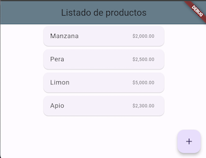
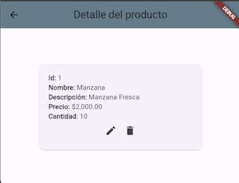
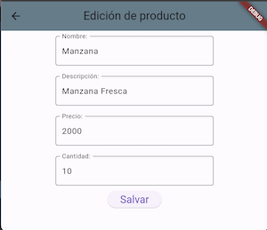
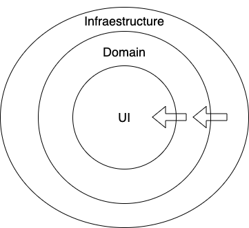
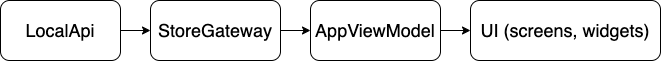
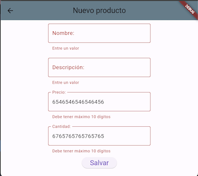

# flutter_application_1

Se creo este proyecto usando el comando de visual code : flutter new apllication

## Descripción general

El proyecto consta de 3 pantallas principales, las cuales se navega mediante las rutas nombradas "named routes"

Home Screen

En esta pantalla se ve el listado de productos. Desde esta pantalla se puede saltar a crear un nuevo registro pulsando el botón flotante.

Detail Screen

Esta pantalla muestra todos los datos asociados al registro de datos. En esta pantalla se puede eliminar el registro o se ir al formulario de edición de datos. También se puede regresar a la pantalla Home con el botón de back.

Form Screen

Esta pantalla es la destinada a crear o editar un nuevo registro de datos. Tiene un botón para guardar los datos (Salvar).

Desde esta pantalla se puede navegar a la pantalla anterior con el back.

### Validaciones en el formulario

Cuando se crean o se edita un registro en el formulario se hace una validación de manera que se valida que no pueden dejar campos vacíos ni de tamaño superior al requerido, por ejemplo para el nombre del producto se aceptan hasta 15 caracteres. Cuando se ingresan los números, se activa un teclado solo numérico y se valida que lo que se ingrese se pueda parsear exitosamente para poderlo ingresar correctamente como número.

## Arquitectura

En cuanto a la arquitectura se uso la arquitectura limpia con 3 capas así:

Arquitectura limpia

En la capa de infraestructura se manejan la API que obtiene los datos y el gateway, el cual está destinado a independizar la fuente de datos con la capa de dominio. Estos en este momento tienen una implementación mokeada de donde se extraen los datos quemados en el app.

Dependencias de clases

La lógica de negocio se está aplicando en el AppViewModel que depende del StoreGateway para obtener los datos. En este viewModel se está guardando el estado del app, el cual es consultado por las demás Pantallas y widgets.

Validación en el formulario

## Versiones

- Dart SDK version: 3.3.1 (stable)
- Flutter 3.19.3 • channel stable
- Framework • revision ba39319843
- Engine • revision 2e4ba9c6fb
- Tools • Dart 3.3.1 • DevTools 2.31.1

Los paquetes adicionales que se han instalado son:

- Provider 6.1.2 -> Manejo de viewModels
- Intl 0.19.0 -> para poder manejar el formato de dinero ($)
